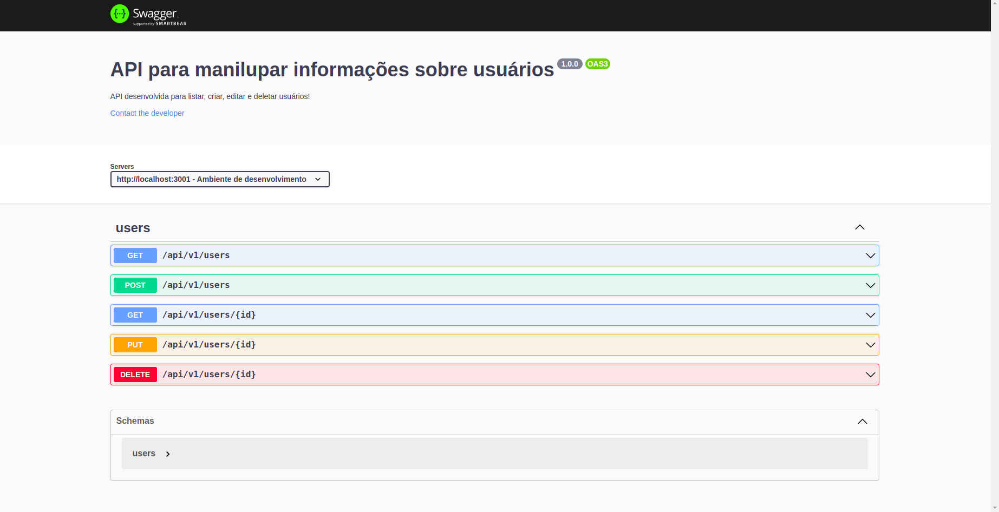
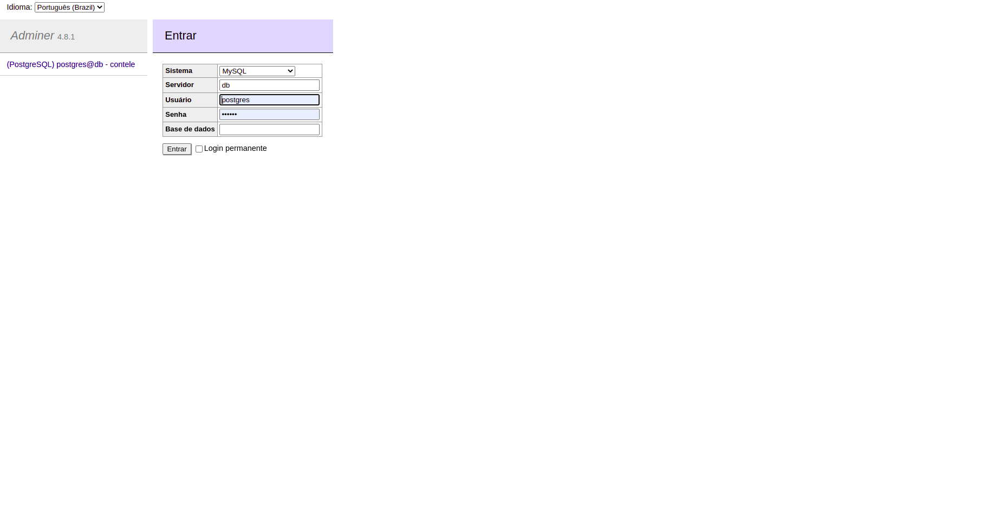

## 💻 Sobre o projeto

API PARA O GERENCIAMENTO DE INFORMAÇÕES SOBRE USUÁRIOS. A API POSSUI UM ENDPOINT COM VALIDAÇÕES E FOI ESTRUTURADA NA ARQUITETURA MSC.

RECURSOS:

- Listar todos usuários.
- Listar único usuário.
- Criar usuário.
- Editar usuário.
- Deletar usuário.

🛠 Tecnologias

As seguintes ferramentas foram usadas na construção do projeto:

* NodeJs
* Express
* Postgres
* JOI
* KNEX


## 🚀 Como executar o projeto

### Pré-requisitos

Antes de começar, você vai precisar ter o [Git](https://git-scm.com) instalado em sua máquina.
Além disto é bom ter um editor para trabalhar com o código como [VSCode](https://code.visualstudio.com/).

### IMPORTANTE

* As seguintes variaveis de ambiente são nescessarias.

```bash
# variavesis de ambiente
PORT=3001
POSTGRES_HOST=db
POSTGRES_USER=postgres
POSTGRES_PASSWORD=123456
POSTGRES_DB=contele
POSTGRES_PORT=5432
WAIT_HOSTS=db_project_contele:5432
```


- Para rodar localmente você precisará ter o Postgres instalado e um banco de dados criado.

Comandos para rodar local:
```bash
# Clone este repositório
$ git clone https://github.com/joao966/joao966-joaoOliveira-fullStackJSJr.git

# instale as dendências
$ npm install

# execute a migrate
$ npx knex migrate:latest

# execute a seed
$ npx knex seed:run

# rode o projeto
$ npm run debug

```


### DOCKER
* Para rodar em uma máquina virtual você precisará ter o Docker e o Docker-Compose instalado.

Comandos para executar virtual:
```bash
# instala as dependencias inicia o banco roda a migrate e a seed e sobe o servidor da API
$ npm run docker
```


### DOCUMENTAÇÃO

* A Documentação está disponível na rota: "/api-doc".



* Acesse o painel admin do banco de dados na rota: localhost:8080




Feito com ❤️ por João Guilherme de Oliveira!
